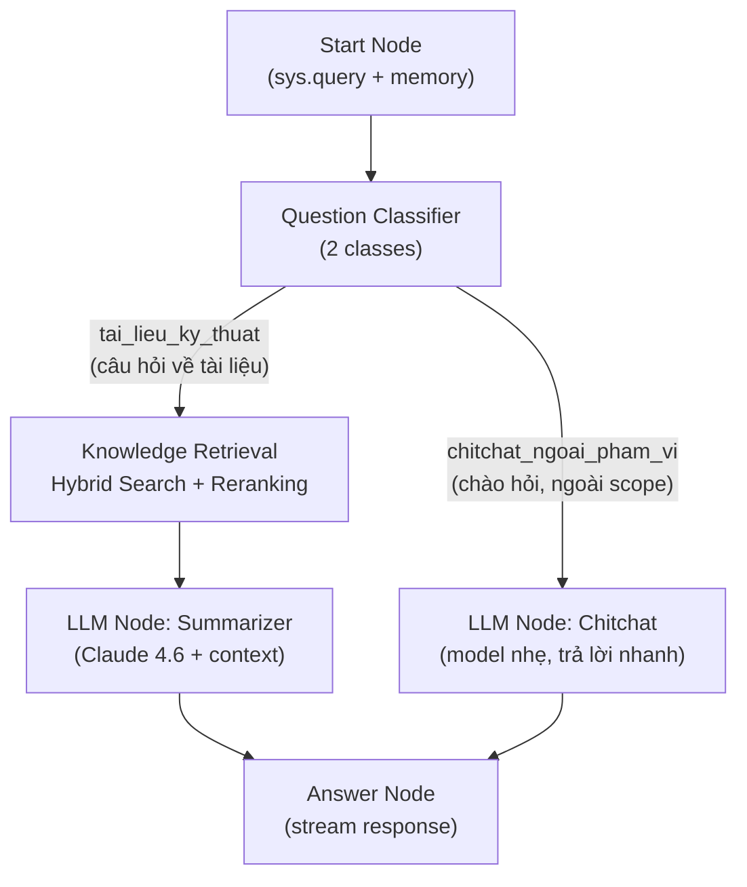

# Agentic RAG Chatbot Napas — Full Dify Architecture (v3.3)

> **v3.3:** Thêm hiển thị ảnh/diagram inline trong chat. Scope: vài tài liệu kỹ thuật (có ảnh, diagram, bảng). Kiến trúc 2 nhánh. Metadata tagging, document citation, conflict handling. Verified.

---

## 1. Tại Sao Bỏ RAGFlow?

| Tiêu chí | RAGFlow + Dify (plan cũ) | Full Dify (plan mới) |
|---|---|---|
| **Complexity vận hành** | 2 hệ thống Docker riêng biệt, sync API | 1 hệ thống Dify duy nhất |
| **Điểm lỗi (failure points)** | RAGFlow down → Dify mất memory | Monolithic, ít điểm lỗi hơn |
| **Knowledge Pipeline** | RAGFlow xử lý ETL riêng, Dify chỉ query | Dify có built-in Knowledge Pipeline (ETL visual) |
| **Multimodal** | RAGFlow OCR + layout-aware | Dify v1.11+ Multimodal KB + Vision Summarization |
| **Reranking** | Phải tự cấu hình | Dify tích hợp sẵn reranking model |
| **Debug & Observability** | 2 UI riêng, khó trace end-to-end | 1 UI, Variable Inspect từng node, test step-by-step |
| **Bảo trì** | 2 codebase update riêng | 1 codebase duy nhất |

---

## 2. Thực Tế Hiện Tại vs. Plan

> [!IMPORTANT]
> **Hiện tại anh có vài tài liệu kỹ thuật.** Vì vậy plan v2 (5 nhánh, 4 Knowledge Bases, multi-department filtering) vẫn là **over-engineering**. Kiến trúc 2 nhánh + 1 KB vẫn đúng — Dify KB hỗ trợ nhiều documents trong 1 KB, Hybrid Search tự tìm đúng document.

| Plan v2 (over-engineering) | Plan v3.2 (right-sized) |
|---|---|
| 5 nhánh Question Classifier | **2 nhánh:** KB Query vs Chitchat |
| 4 Knowledge Bases riêng biệt | **1 Knowledge Base** (nhiều docs, metadata tag per doc) |
| Agent Node cho tech support | Chưa cần — thêm sau khi mở rộng |
| Metadata filtering by department | Metadata tag by `doc_name` (cho citation, chưa cần filter) |
| Multi-model routing phức tạp | **1 model chính** + 1 model nhẹ cho chitchat |

> **Nguyên tắc:** Ship lean, scale later. Khi tài liệu tăng lên nhiều hơn → thêm nhánh + KB + Agent Node dần dần.

---

## 3. Kiến Trúc Đơn Giản Hóa

```
┌─────────────────────────────────────────────────────────────┐
│                    TẦNG 1 — FACE                            │
│              Next.js (Custom UI/UX Napas)                   │
│         SSE Streaming · JWT Auth · Admin Panel              │
│                        │                                    │
│                   Dify Chat API                             │
│                   (streaming)                               │
├─────────────────────────────────────────────────────────────┤
│                TẦNG 2 — BRAIN + MEMORY                      │
│                   Dify (self-hosted)                         │
│                                                             │
│   ┌──────────────────────────────────────────────────────┐  │
│   │              CHATFLOW (Lean)                          │  │
│   │                                                       │  │
│   │   Start ──→ Question Classifier                       │  │
│   │                  │                                    │  │
│   │          ┌───────┴───────┐                            │  │
│   │          ▼               ▼                            │  │
│   │     Nhánh KB        Nhánh Chitchat                    │  │
│   │          │               │                            │  │
│   │     Knowledge        LLM Node                         │  │
│   │     Retrieval        (Direct)                         │  │
│   │          │               │                            │  │
│   │     LLM Node             │                            │  │
│   │     (w/ context)         │                            │  │
│   │          │               │                            │  │
│   │          └───────┬───────┘                            │  │
│   │              Answer Node                              │  │
│   └──────────────────────────────────────────────────────┘  │
│                                                             │
│   ┌──────────────────────────────────────────────────────┐  │
│   │        KNOWLEDGE BASE (1 KB duy nhất)                 │  │
│   │   Multimodal KB (Dify v1.11+)                         │  │
│   │   Hybrid Search · Reranking · Parent-Child Chunking   │  │
│   │   Text + Bảng + Ảnh/Diagram descriptions              │  │
│   └──────────────────────────────────────────────────────┘  │
├─────────────────────────────────────────────────────────────┤
│                    TẦNG 3 — LLM ENGINE                      │
│     OpenRouter → Claude 4.6 Sonnet (primary)                │
│     OpenRouter → Haiku/Llama-3 (chitchat, tiết kiệm)       │
│     Gemini 2.5 Pro Vision (pre-processing ảnh/diagram)      │
└─────────────────────────────────────────────────────────────┘
```

---

## 4. Chatflow Chi Tiết — 2 Nhánh

> [!IMPORTANT]
> **Chỉ 2 nhánh là đủ** cho 1 tài liệu kỹ thuật. Question Classifier phân biệt: (1) câu hỏi cần tra cứu tài liệu vs (2) chào hỏi/ngoài phạm vi. Đơn giản, ổn định, production-ready.

### 4.1 Sơ Đồ Chatflow



### 4.2 Node-by-Node Design

#### A. Start Node
- Nhận `sys.query` + `sys.conversation_id`
- **Conversation Memory:** bật, window size = 10 turns
- Không cần input variables phức tạp (1 tài liệu, không phân quyền)

#### B. Question Classifier (2 Classes)

| Class | Mô tả | Route đến |
|---|---|---|
| `tai_lieu_ky_thuat` | Câu hỏi **trực tiếp liên quan** đến nội dung tài liệu kỹ thuật Napas: khái niệm thanh toán, quy trình kỹ thuật, API, sơ đồ luồng, bảng số liệu, hướng dẫn tích hợp. **Không bao gồm** chào hỏi, cảm ơn, hoặc câu hỏi về thời tiết/tin tức. | → Knowledge Retrieval |
| `chitchat_ngoai_pham_vi` | Tất cả câu hỏi **không liên quan** đến tài liệu kỹ thuật: chào hỏi, cảm ơn, câu hỏi cá nhân, yêu cầu ngoài phạm vi. **Bao gồm** mọi thứ không thuộc class 1. | → LLM Direct |

- **Model:** Claude 4.6 Sonnet (hoặc model nhẹ hơn để tiết kiệm)
- **Mục đích:** Short-circuit chitchat → không tốn token retrieve, giảm latency + chi phí

> [!WARNING]
> **Stability tip (verified):** Mô tả class phải **rõ ràng, không chồng chéo**. Dùng "boundary phrases" ("Không bao gồm...", "Bao gồm mọi thứ không thuộc...") để giảm ambiguity. Nếu classifier hay phân loại sai → kiểm tra: (1) mô tả class đủ rõ chưa, (2) thử model mạnh hơn cho classifier node. Đây là issue phổ biến được community report.

#### C. Knowledge Retrieval Node

```yaml
knowledge_base: napas_tai_lieu_ky_thuat    # 1 KB, nhiều documents bên trong
search_method: hybrid                       # keyword + semantic (QUAN TRỌNG)
top_k: 8                                    # Tăng từ 5→8: nhiều docs = cần retrieve rộng hơn
score_threshold: 0.4                        # BẮT ĐẦU thấp, tune lên dần (xem 4.3)
reranking:
  enabled: true                             # QUAN TRỌNG HƠN với nhiều docs (lọc noise)
  model: bge-reranker-v2-m3                 # Cần self-host riêng (xem 4.4)
```

> [!NOTE]
> **Tại sao top_k = 8?** Với vài tài liệu, số chunks tăng lên → cần retrieve rộng hơn (top_k cao hơn) để reranker có đủ candidates mà lọc. Reranking sẽ re-score và chỉ giữ chunks thật sự liên quan.

**Tại sao Hybrid Search là lựa chọn đúng:**

| Search Mode | Điểm mạnh | Điểm yếu | Phù hợp? |
|---|---|---|---|
| **Semantic only** | Hiểu intent, synonyms | Bỏ sót thuật ngữ chuyên ngành chính xác | ⚠️ Thiếu |
| **Full-text only** | Exact match thuật ngữ | Không hiểu context, cứng nhắc | ⚠️ Thiếu |
| **Hybrid** | **Cả hai**: hiểu intent + match chính xác | Phức tạp hơn một chút | ✅ **Đúng** |

> Tài liệu kỹ thuật Napas vừa có **thuật ngữ chuyên ngành** (cần keyword match) vừa có người hỏi bằng **ngôn ngữ tự nhiên** (cần semantic). **Hybrid Search + Reranking** là combo tối ưu.

### 4.3 Tuning Score Threshold (Quan Trọng)

> [!WARNING]
> **Không hardcode score_threshold.** Giá trị tối ưu phụ thuộc vào embedding model, content, và cách chunking. Phải test thực tế.

**Quy trình tuning:**

```
1. Bắt đầu với score_threshold = 0.4 (permissive, đảm bảo không mất kết quả)
2. Dùng Dify "Test Knowledge Retrieval" tool:
   → Input 10-15 câu hỏi mẫu thực tế
   → Ghi lại score của chunk "đúng" (golden chunk)
   → Ghi lại score của chunk "nhiễu" (irrelevant)
3. Đặt threshold = score thấp nhất của golden chunk - 0.05
   → Ví dụ: golden chunks score 0.55-0.85 → set threshold = 0.5
4. Bật Reranking → reranker sẽ loại bỏ noise còn lại
5. Test lại, tăng dần threshold nếu vẫn có nhiều noise
```

| Threshold | Khi nào dùng |
|---|---|
| **0.3-0.4** | Giai đoạn đầu, KB ít content, muốn không bỏ sót |
| **0.5-0.6** | Production ổn định, đã test đủ |
| **0.7+** | Chỉ khi cần precision cực cao, chấp nhận bỏ sót |

### 4.4 Self-Hosting Reranking Model (Lưu Ý Quan Trọng)

> [!CAUTION]
> **Dify KHÔNG tự host reranking model.** Anh phải host `bge-reranker-v2-m3` riêng trên server có GPU, rồi kết nối vào Dify qua Model Provider.

**Cách setup:**

```bash
# Option 1: Text Embeddings Inference (TEI) — cần GPU
docker run -d --gpus all -p 8002:80 \
  -v /data/rerank-cache:/data \
  ghcr.io/huggingface/text-embeddings-inference:latest \
  --model-id BAAI/bge-reranker-v2-m3

# Option 2: GPUStack (nếu đã dùng)
# Deploy model trong GPUStack → lấy Server URL + API Key
```

**Kết nối vào Dify:**
1. Dify Admin → Settings → Model Provider
2. Thêm provider (OpenAI-compatible hoặc GPUStack plugin)
3. Server URL: `http://<server-ip>:8002` (KHÔNG dùng localhost, dùng IP thật)
4. Model Type: **Rerank**
5. Settings → System Model Settings → chọn reranking model mặc định

**Nếu không có GPU:** Dùng **Cohere Rerank API** (cloud, trả phí) thay thế — không cần GPU, chỉ cần API key.

#### D. LLM Node — Summarizer (cho nhánh KB)

```
System Prompt:
Bạn là trợ lý AI nội bộ của Napas, chuyên về các tài liệu kỹ thuật.

Quy tắc:
1. CHỈ trả lời dựa trên nội dung tài liệu được cung cấp trong {context}.
2. Nếu không tìm thấy thông tin, nói rõ: "Tôi không tìm thấy thông tin này trong các tài liệu kỹ thuật."
3. Khi trích dẫn, LUÔN ghi rõ **tên tài liệu nguồn** và phần/mục cụ thể.
   Ví dụ: "Theo tài liệu [Hướng dẫn tích hợp API v2.1], mục 3.2: ..."
4. Nếu thông tin từ nhiều tài liệu MÂU THUẪN nhau:
   - Ưu tiên tài liệu có version/ngày mới hơn
   - Nêu rõ sự khác biệt cho user: "Tài liệu A nói X, nhưng tài liệu B (mới hơn) nói Y"
5. Nếu context có link ảnh dạng ``, **GIỮ NGUYÊN link ảnh** trong response để frontend render. Đặt ảnh ngay sau đoạn giải thích liên quan.
6. Trả lời bằng tiếng Việt, rõ ràng, chuyên nghiệp.
7. Nếu câu hỏi nằm ngoài phạm vi tài liệu, từ chối lịch sự và hướng dẫn hỏi đúng chủ đề.

Tài liệu tham khảo:
{context}
```

- **Model:** Claude 4.6 Sonnet
- **Temperature:** 0.2 (ưu tiên chính xác cho tài liệu kỹ thuật)
- **Max tokens:** 2048

#### E. LLM Node — Chitchat (Direct)

- **Model:** Haiku hoặc Llama-3 (via OpenRouter, tiết kiệm)
- **Temperature:** 0.7
- **System prompt:** "Bạn là trợ lý AI nội bộ Napas. Chào hỏi thân thiện, chuyên nghiệp. Nếu câu hỏi nằm ngoài phạm vi tài liệu kỹ thuật, hướng dẫn user hỏi lại đúng chủ đề."

#### F. Answer Node
- Nhận output từ cả 2 nhánh → stream response về user qua SSE

---

## 5. Xử Lý Multimodal — Ảnh, Diagram, Bảng

> [!IMPORTANT]
> Đây là phần quan trọng nhất vì tài liệu kỹ thuật của anh có **ảnh, diagram bằng ảnh, và bảng**. Chiến lược: **2 lớp xử lý** để đảm bảo tất cả content đều searchable.

### 5.1 Chiến Lược 2 Lớp

```
Tài liệu kỹ thuật gốc (PDF/DOCX có ảnh + diagram + bảng)
    │
    ├── LỚP 1: Text + Bảng (tự động, Dify xử lý)
    │   │
    │   ├─ Text thuần → Dify Document Extractor parse bình thường
    │   ├─ Bảng đơn giản → Dify convert → Markdown table tự động
    │   └─ Bảng phức tạp (merge cell) → Pre-processing script → Markdown
    │
    │   → Index vào KB: napas_tai_lieu_ky_thuat
    │   → Search: Hybrid Search + Reranking
    │   → Xử lý được ~70% câu hỏi
    │
    └── LỚP 2: Ảnh + Diagram (pre-processing thủ công/bán tự động)
        │
        ├─ Extract ảnh/diagram từ tài liệu
        │
        ├─ Vision Model (Gemini 2.5 Pro) "nhìn" từng ảnh
        │  → Sinh mô tả text chi tiết cho mỗi ảnh/diagram
        │  → Ví dụ: "Sơ đồ luồng thanh toán qua NAPAS: 
        │     Bước 1: Merchant gửi request → NAPAS Gateway
        │     Bước 2: NAPAS Gateway validate → Route tới Issuer..."
        │
        └─ Index text mô tả vào CÙNG Knowledge Base
           → User hỏi "luồng thanh toán" → match text mô tả
           → Xử lý được 30% câu hỏi còn lại về ảnh/diagram
```

### 5.2 Pre-processing Pipeline

```python
# scripts/preprocess_multimodal.py
# Chạy 1 lần PER DOCUMENT khi import tài liệu mới

"""
Pipeline xử lý tài liệu kỹ thuật có ảnh + diagram + bảng
Chạy cho TỪNG tài liệu → output .md riêng, tag rõ nguồn
"""

# BƯỚC 1: Extract text + bảng từ PDF/DOCX
# → Dify Document Extractor xử lý tự động khi upload
# → Không cần script, chỉ cần upload file gốc vào Dify KB

# BƯỚC 2: Extract ảnh từ tài liệu
# Tool: python-docx (cho DOCX) hoặc pymupdf/fitz (cho PDF)
#
# ⚠️ GIỚI HẠN QUAN TRỌNG (verified):
# - pymupdf get_images() chỉ extract RASTER images (JPG, PNG embedded)
# - KHÔNG extract được VECTOR GRAPHICS (sơ đồ vẽ bằng lines/shapes trong PDF)
# - Nếu diagram là vector → cần dùng page.get_pixmap() để screenshot cả trang
# - Ảnh nhỏ < 5% kích thước trang có thể bị bỏ qua (icons, bullets)
#
import fitz  # pymupdf
from pathlib import Path

def extract_images_from_pdf(pdf_path: str, output_dir: str):
    """Extract tất cả ảnh từ PDF, lưu ra folder.
    
    Bao gồm cả fallback: nếu trang có ít/không có embedded images
    nhưng có nhiều drawings → screenshot cả trang.
    """
    doc = fitz.open(pdf_path)
    images = []
    for page_num in range(len(doc)):
        page = doc[page_num]
        page_images = page.get_images(full=True)
        
        # Extract embedded raster images
        for img_index, img in enumerate(page_images):
            xref = img[0]
            base_image = doc.extract_image(xref)
            image_bytes = base_image["image"]
            image_ext = base_image["ext"]
            
            filename = f"page{page_num+1}_img{img_index+1}.{image_ext}"
            filepath = f"{output_dir}/{filename}"
            with open(filepath, "wb") as f:
                f.write(image_bytes)
            
            images.append({
                "file": filepath,
                "page": page_num + 1,
                "index": img_index + 1,
                "type": "embedded"
            })
        
        # Fallback: nếu trang có drawings (vector diagrams) nhưng ít embedded images
        # → screenshot cả trang để Vision Model phân tích
        drawings = page.get_drawings()
        if len(drawings) > 10 and len(page_images) < 2:  # Nhiều drawings, ít ảnh
            pix = page.get_pixmap(dpi=200)
            screenshot_path = f"{output_dir}/page{page_num+1}_screenshot.png"
            pix.save(screenshot_path)
            images.append({
                "file": screenshot_path,
                "page": page_num + 1,
                "index": 0,
                "type": "page_screenshot"  # Đánh dấu để Vision Model biết context
            })
    
    return images

# BƯỚC 3: Vision Model mô tả từng ảnh
# Gọi Gemini 2.5 Pro Vision hoặc GPT-4o
import base64
import requests

def describe_image_with_vision(image_path: str, context: str = "") -> str:
    """Dùng Vision Model để sinh mô tả text cho ảnh/diagram."""
    with open(image_path, "rb") as f:
        image_b64 = base64.b64encode(f.read()).decode()
    
    # Gọi qua OpenRouter (hoặc direct API)
    response = requests.post(
        "https://openrouter.ai/api/v1/chat/completions",
        headers={
            "Authorization": f"Bearer {OPENROUTER_API_KEY}",
            "Content-Type": "application/json"
        },
        json={
            "model": "google/gemini-2.5-pro",
            "messages": [{
                "role": "user",
                "content": [
                    {"type": "text", "text": f"""Mô tả chi tiết nội dung của ảnh/diagram này bằng tiếng Việt.
Nếu đây là sơ đồ luồng (flowchart), liệt kê từng bước.
Nếu đây là bảng, chuyển thành dạng text có cấu trúc.
Nếu đây là biểu đồ, mô tả dữ liệu và xu hướng.

Context trong tài liệu: {context}"""},
                    {"type": "image_url", "image_url": {
                        "url": f"data:image/png;base64,{image_b64}"
                    }}
                ]
            }]
        }
    )
    return response.json()["choices"][0]["message"]["content"]

# BƯỚC 4: Tổng hợp output → file Markdown (KÈM LINK ẢNH GỐC)
IMAGE_BASE_URL = "/docs/images"  # URL path trên Next.js website

def create_image_descriptions_md(images: list, doc_name: str, output_path: str):
    """Tạo file .md chứa mô tả + LINK ẢNH GỐC cho 1 tài liệu.
    
    Mỗi chunk sẽ chứa:
    -  → frontend render ảnh inline trong chat
    - Mô tả text → cho Hybrid Search + LLM context
    """
    doc_slug = doc_name.replace(" ", "_").lower()
    output = [f"# Mô Tả Ảnh và Diagram — {doc_name}\n"]
    output.append(f"**Tài liệu nguồn:** {doc_name}\n")
    
    for img in images:
        description = describe_image_with_vision(img["file"])
        img_filename = Path(img["file"]).name
        img_url = f"{IMAGE_BASE_URL}/{doc_slug}/{img_filename}"
        
        output.append(f"## [{doc_name}] Hình ảnh trang {img['page']}, ảnh {img['index']}")
        output.append(f"**Nguồn:** {doc_name}, Trang {img['page']}")
        output.append(f"")
        output.append(f"![{doc_name} - Trang {img['page']}]({img_url})")
        output.append(f"")
        output.append(f"**Mô tả chi tiết:**\n{description}\n")
        output.append("---\n")
    
    with open(output_path, "w", encoding="utf-8") as f:
        f.write("\n".join(output))

# BƯỚC 5: Copy ảnh gốc vào Next.js public folder (để serve trên web)
import shutil

def copy_images_to_public(images: list, doc_name: str, public_dir: str):
    """Copy ảnh gốc vào /public/docs/images/{doc_slug}/ để frontend hiển thị."""
    doc_slug = doc_name.replace(" ", "_").lower()
    target_dir = Path(public_dir) / "docs" / "images" / doc_slug
    target_dir.mkdir(parents=True, exist_ok=True)
    
    for img in images:
        shutil.copy2(img["file"], target_dir / Path(img["file"]).name)
    
    print(f"✅ Copied {len(images)} images to {target_dir}")

# === PIPELINE ĐẦY ĐỦ (chạy cho TỪNG tài liệu) ===
# 1. images = extract_images_from_pdf("api_guide.pdf", "temp/")
# 2. copy_images_to_public(images, "Huong_dan_API_v2.1", "../nextjs-app/public/")
# 3. create_image_descriptions_md(images, "Huong_dan_API_v2.1", "output/api_images.md")
# 4. Upload output/api_images.md vào Dify KB
#
# Kết quả: KB chunk chứa cả mô tả text LẪN 
# → LLM trả lời kèm image link → frontend render ảnh inline
```

### 5.3 Kết Quả Sau Pre-processing (Per Document)

Dify Knowledge Base `napas_tai_lieu_ky_thuat` sẽ chứa:

| Nguồn | Loại content | Cách index |
|---|---|---|
| File gốc 1 (PDF/DOCX) | Text + Bảng | Upload trực tiếp → Dify auto-parse |
| File gốc 2 (PDF/DOCX) | Text + Bảng | Upload trực tiếp → Dify auto-parse |
| File gốc N... | Text + Bảng | Upload trực tiếp → Dify auto-parse |
| `doc1_image_descriptions.md` | Mô tả ảnh/diagram doc 1 | Upload → tag nguồn trong content |
| `doc2_image_descriptions.md` | Mô tả ảnh/diagram doc 2 | Upload → tag nguồn trong content |
| `complex_tables.md` (nếu có) | Bảng phức tạp → Markdown | Python pre-process → upload |

> **Key:** Mỗi image description file chứa tên tài liệu nguồn trong content → khi retrieve, LLM biết chunk đến từ tài liệu nào → cite chính xác.

### 5.4 Tùy chọn bổ sung: Dify Multimodal KB (v1.11+)

Ngoài Vision Summarization ở trên, có thể **bật thêm** Multimodal KB:

```yaml
# Khi tạo Knowledge Base trong Dify:
embedding_model: "multimodal-embedding-model"  # Chọn model có badge VISION
index_method: "high_quality"                    # BẮT BUỘC cho multimodal
```

**Lợi ích:** Ảnh được embed vào cùng vector space với text → hỗ trợ Text-to-Image search.
**Hạn chế:** Multimodal embedding chưa hoàn hảo cho diagram kỹ thuật phức tạp → vì vậy **Vision Summarization vẫn là lớp chính**.

---

## 6. Knowledge Base Configuration

### 6.1 Cấu Trúc — 1 KB Duy Nhất

> [!WARNING]
> **Lưu ý:** Chunking mode (General vs Parent-Child) **KHÔNG THỂ đổi** sau khi tạo KB. Index method (High Quality vs Economical) cũng vậy. Chọn đúng ngay từ đầu.

```yaml
name: napas_tai_lieu_ky_thuat
description: "Các tài liệu kỹ thuật nội bộ Napas — text, bảng, và mô tả diagram"

# Metadata Tagging (QUAN TRỌNG cho multi-document)
# Khi upload mỗi document vào Dify KB, tag metadata:
metadata_tags:
  - doc_name: "Hướng dẫn tích hợp API v2.1"    # Tên tài liệu
  - doc_topic: "API Integration"                 # Chủ đề
  - doc_version: "2.1"                            # Version
  - doc_date: "2025-06-01"                        # Ngày ban hành

# Mục đích metadata:
# 1. LLM cite đúng tên tài liệu (thông qua content trong chunk)
# 2. Sau này nếu cần filter → đã có sẵn metadata
# 3. Xử lý conflict version cũ/mới

# Chunking Strategy
# Trong Dify UI: chọn "Parent-Child" mode khi tạo KB
chunking:
  strategy: parent_child          # HQ mode — chọn khi tạo KB, KHÔNG đổi được sau
  parent_mode: paragraph          # "Paragraph" (recommended) hoặc "Full Doc"
  parent_delimiter: "\n\n"        # Split parent chunks theo đoạn văn
  parent_max_length: 2000         # characters — context rộng
  child_delimiter: "\n"           # Split child chunks trong parent
  child_max_length: 500           # characters — retrieval chính xác
  overlap: 50                     # characters overlap giữa các child chunks

# Index
index_method: high_quality        # BẮT BUỘC cho Hybrid Search + Reranking
embedding_model: text-embedding-3-large  # hoặc multimodal model nếu dùng

# Retrieval
search_method: hybrid             # keyword + semantic
top_k: 8                          # Tăng cho multi-doc
score_threshold: 0.4              # Tune dần (xem 4.3)
reranking:
  enabled: true                   # QUAN TRỌNG HƠN với nhiều docs
  model: bge-reranker-v2-m3
```

### 6.2 Tại Sao Parent-Child Chunking?

```
Tài liệu kỹ thuật dài
    │
    ▼
┌─────────────────────────────────────────────┐
│  PARENT CHUNK (2000 tokens)                  │
│  "Chương 3: Luồng thanh toán qua NAPAS..."   │
│                                               │
│  ┌─────────┐ ┌─────────┐ ┌─────────┐        │
│  │ Child 1 │ │ Child 2 │ │ Child 3 │        │
│  │ 500 tok │ │ 500 tok │ │ 500 tok │        │
│  └─────────┘ └─────────┘ └─────────┘        │
└─────────────────────────────────────────────┘

User hỏi → Match Child 2 (chính xác)
         → Trả về Parent chunk (đầy đủ context)
         → LLM có đủ thông tin để trả lời tốt
```

---

## 7. Deployment (Giữ Nguyên)

### 7.1 Docker Compose — Dify Self-Hosted

```bash
git clone https://github.com/langgenius/dify.git
cd dify/docker
cp .env.example .env
# Edit .env: SECRET_KEY, VECTOR_STORE=weaviate
docker compose up -d
# Admin: http://localhost:3000
```

### 7.2 Yêu Cầu Server

| Resource | Minimum | Recommended |
|---|---|---|
| CPU | 4 cores | 8 cores |
| RAM | 16 GB | 32 GB |
| Storage | 50 GB SSD | 100 GB SSD |
| Docker | 24.0+ | 24.0+ |

---

## 8. Tầng Face — Next.js

### 8.1 API Route (Dify Integration)

```typescript
// app/api/chat/route.ts
export async function POST(req: Request) {
  const { message, conversationId, userId } = await req.json();

  const response = await fetch(`${process.env.DIFY_BASE_URL}/v1/chat-messages`, {
    method: "POST",
    headers: {
      "Authorization": `Bearer ${process.env.DIFY_API_KEY}`,
      "Content-Type": "application/json",
    },
    body: JSON.stringify({
      query: message,
      conversation_id: conversationId,
      response_mode: "streaming",
      user: userId,
    }),
  });

  return new Response(response.body, {
    headers: { "Content-Type": "text/event-stream" },
  });
}
```

### 8.2 Hiển Thị Ảnh/Diagram Inline Trong Chat

LLM response chứa markdown image links `` → frontend render ảnh inline:

```typescript
// components/ChatMessage.tsx
import ReactMarkdown from 'react-markdown';
import { useState } from 'react';

function ChatMessage({ content }: { content: string }) {
  const [fullscreenImg, setFullscreenImg] = useState<string | null>(null);

  return (
    <>
      <div className="chat-message">
        <ReactMarkdown
          components={{
            img: ({ src, alt }) => (
              <figure className="chat-diagram">
                 setFullscreenImg(src || null)}
                />
                {alt && <figcaption style={{ fontSize: '0.85em', color: '#666' }}>{alt}</figcaption>}
              </figure>
            ),
          }}
        >
          {content}
        </ReactMarkdown>
      </div>

      {/* Fullscreen overlay khi click ảnh */}
      {fullscreenImg && (
        <div
          className="fullscreen-overlay"
          style={{
            position: 'fixed', inset: 0, background: 'rgba(0,0,0,0.85)',
            display: 'flex', alignItems: 'center', justifyContent: 'center',
            zIndex: 1000, cursor: 'pointer',
          }}
          onClick={() => setFullscreenImg(null)}
        >
          
        </div>
      )}
    </>
  );
}
```

**Luồng hiển thị:**
```
User: "Cho tôi xem sơ đồ luồng thanh toán"
    │
    ▼
KB retrieve chunk chứa:
  - Text mô tả: "Sơ đồ gồm 5 bước..."
  - Image link: 
    │
    ▼
LLM response (giữ nguyên image link):
  "Theo tài liệu [API v2.1], luồng thanh toán:
   
   Bước 1: Merchant gửi request..."
    │
    ▼
ReactMarkdown render:
  → Ảnh gốc hiển thị inline, click để zoom fullscreen
  → Text giải thích bên dưới
```

### 8.3 Static Image Serving

```
/nextjs-app/public/
  └── docs/
      └── images/
          ├── huong_dan_api_v2.1/
          │   ├── page5_img1.png
          │   ├── page12_img2.png
          │   └── page8_screenshot.png
          └── quy_trinh_thanh_toan/
              ├── page3_img1.png
              └── page7_screenshot.png
```

Next.js tự động serve files trong `/public/` → không cần config thêm.

## 9. LLM Engine

| Vai trò | Model | Khi nào dùng |
|---|---|---|
| **KB Summarizer** | Claude 4.6 Sonnet | Trả lời câu hỏi từ tài liệu |
| **Question Classifier** | Claude 4.6 Sonnet (hoặc nhẹ hơn) | Phân loại intent |
| **Chitchat** | Haiku / Llama-3 | Chào hỏi, ngoài phạm vi |
| **Vision Pre-processing** | Gemini 2.5 Pro Vision | Mô tả ảnh/diagram (chạy 1 lần khi import) |
| **Embedding** | text-embedding-3-large | Vector hóa text chunks |
| **Reranking** | bge-reranker-v2-m3 | Re-score kết quả retrieval |

---

## 10. Rủi Ro & Giải Pháp

| Rủi ro | Mức độ | Giải pháp |
|---|---|---|
| Vision Model mô tả sai diagram phức tạp | Trung bình | Review thủ công output trước khi index, sửa nếu sai |
| Hybrid Search trả về chunks không liên quan | Thấp | Score threshold tuning + Reranking loại bỏ noise |
| LLM hallucination | Trung bình | System prompt strict "CHỈ trả lời từ context" + temperature 0.2 |
| Bảng phức tạp (merge cell) bị parse sai | Trung bình | Pre-processing Python → Markdown trước khi import |
| **Mâu thuẫn giữa các tài liệu** | **Trung bình** | System prompt xử lý conflict: ưu tiên version mới, nêu rõ khác biệt |
| **LLM cite sai tài liệu nguồn** | Trung bình | Metadata tag per doc + tên doc trong chunk content |
| Latency cao khi KB lớn | Thấp (vài tài liệu) | Monitor, tăng top_k + reranking đã xử lý |

---

## 11. Tech Stack Tóm Tắt (v3 — Lean)

```
LAYER              TECHNOLOGY              ROLE
──────────────────────────────────────────────────────────────
Face               Next.js (App Router)    Custom UI/UX Napas
                   Custom SSE Parsing      Streaming chat
                   Custom JWT (jose)       Auth / Session

Brain              Dify Chatflow           2-branch orchestration
                   Question Classifier     Intent routing (KB vs Chitchat)
                   Knowledge Retrieval     Hybrid Search + Reranking
                   LLM Nodes              Summarizer + Chitchat

Memory             Dify Knowledge Base     1 KB — multi-doc + image descriptions
                   Metadata Tagging        doc_name, doc_topic, doc_version per doc
                   Parent-Child Chunking   Precision retrieval, full context
                   Weaviate (built-in)     Vector storage
                   Hybrid Search           Keyword + Semantic
                   Reranking               Cross-encoder re-scoring

Pre-processing     pymupdf + Vision API    Extract & describe images/diagrams
                   openpyxl (nếu cần)      Complex table → Markdown

LLM Gateway        OpenRouter API          Unified API
LLM                Claude 4.6 Sonnet       Primary (KB + Classifier)
                   Haiku / Llama-3         Chitchat (cost-optimized)
                   Gemini 2.5 Pro Vision   Image/diagram description

Embedding          text-embedding-3-large  Vector embedding
Reranking          bge-reranker-v2-m3      Result re-scoring

Infra              Docker Compose          Dify self-hosted
                   PostgreSQL + Redis      App state + cache
                   Weaviate                Vector DB
```

---

## 12. Kế Hoạch Triển Khai (Lean Phases)

### Phase 1 — Foundation (Tuần 1)
- [ ] Deploy Dify self-hosted (Docker Compose)
- [ ] Cấu hình Model Providers (OpenRouter: Claude 4.6, Haiku)
- [ ] Cấu hình Embedding model (text-embedding-3-large)
- [ ] Cấu hình Reranking model (bge-reranker-v2-m3)

### Phase 2 — Knowledge Base + Pre-processing (Tuần 2)
- [ ] Tạo KB: `napas_tai_lieu_ky_thuat` (Parent-Child, HQ, Hybrid Search)
- [ ] Upload tài liệu text gốc vào KB → test chunking + retrieval
- [ ] Chạy pre-processing script: extract ảnh → Vision describe → .md
- [ ] Upload image_descriptions.md vào cùng KB
- [ ] Test retrieval: hỏi về text, hỏi về diagram → verify cả 2 đều trả lời được

### Phase 3 — Chatflow Build (Tuần 3)
- [ ] Xây Chatflow: Start → Question Classifier → 2 nhánh
- [ ] Nhánh KB: Knowledge Retrieval → LLM Summarizer
- [ ] Nhánh Chitchat: LLM Direct
- [ ] Test trong Dify Preview, tune prompt + parameters

### Phase 4 — Website (Tuần 4-5)
- [ ] Build Next.js (Chat UI + Streaming SSE)
- [ ] Tích hợp Dify Chat API
- [ ] JWT Auth
- [ ] Conversation history, feedback (thumbs up/down)

### Phase 5 — Scale (Khi cần)
- [ ] Thêm tài liệu → thêm KB hoặc enrich KB hiện tại
- [ ] Thêm nhánh Question Classifier khi có nhiều loại tài liệu
- [ ] Thêm Agent Node khi cần gọi API nội bộ / multi-step reasoning
- [ ] Thêm metadata filtering khi cần phân quyền

---

## Open Questions

> [!IMPORTANT]
> 1. **Có bao nhiêu tài liệu** kỹ thuật cần import? Format gì (PDF, DOCX, hay cả hai)?
> 2. **Ảnh/diagram** trong tài liệu có nhiều không? Ước tính bao nhiêu ảnh tổng cộng?
> 3. **Có tài liệu nào overlap/mâu thuẫn** nhau không? (version cũ vs mới cùng chủ đề)
> 4. **Embedding model:** Dùng `text-embedding-3-large` (OpenAI API, ~$0.13/1M tokens) hay tự host qua Ollama?
> 5. **Server:** Đã có server sẵn để deploy Dify hay cần chuẩn bị? Có GPU cho reranking không?

---

*Plan v3.3 — Lean Dify Architecture cho vài tài liệu kỹ thuật với inline image display. Right-sized, production-ready, scalable.*

